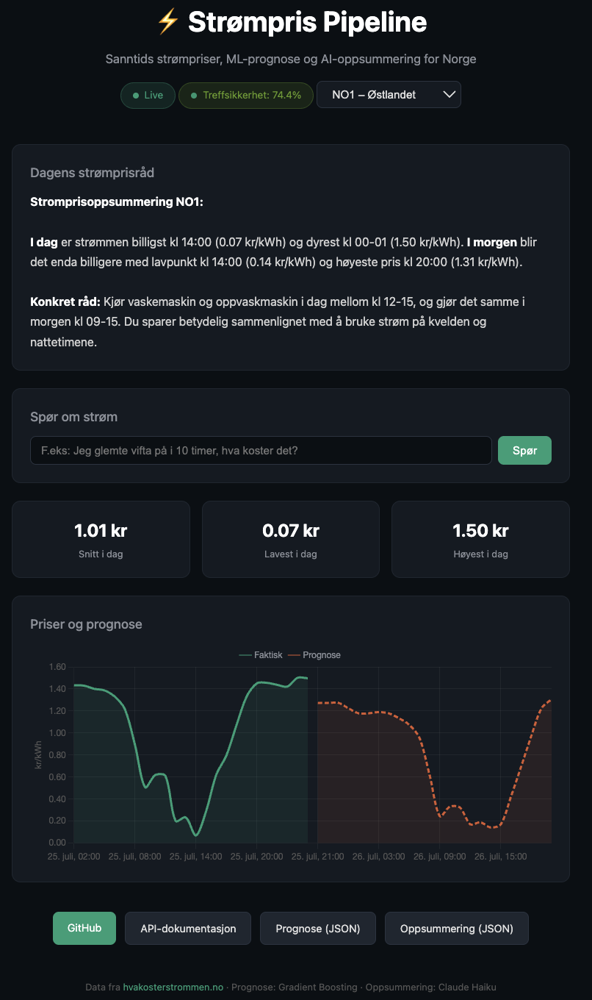

# ⚡ Strømpris Pipeline

A real-time Norwegian electricity price platform with ML forecasting, weather-enhanced predictions, and LLM-powered insights — from data ingestion to cloud deployment.

**[→ Live Demo](https://strompris-pipeline.fly.dev/)** · **[→ API Docs](https://strompris-pipeline.fly.dev/docs)** · **[→ Forecast JSON](https://strompris-pipeline.fly.dev/forecast)**

## Why I Built This

I finished my second year as a software engineering student at OsloMet and started this summer project. After building a crypto API data pipeline in my first year, I wanted to go deeper — not just call an API and print results, but own the whole lifecycle: ingestion, storage, modelling, serving, and deploying it for real. I picked Norwegian electricity prices because it's data that actually matters to people here, and because the Norwegian tech market is short on exactly the skills this project forced me to learn: data engineering, cloud deployment, and integrating AI into real systems. Every part of this was built from scratch, not from a tutorial.



## What It Does

Ingests hourly Norwegian electricity spot prices across all five price zones (NO1–NO5), stores four years of history in PostgreSQL, forecasts the next 24 hours using a weather-enhanced ML model, generates natural-language daily advice via an LLM, and lets users ask freeform questions about their electricity costs — all served through a documented REST API and a live landing page with interactive charts.

## Architecture

```
hvakosterstrommen.no    Open-Meteo (weather)
        │                       │
        ▼                       ▼
  Ingestion (Python)     Weather Ingestion
        │                       │
        └───────┬───────────────┘
                ▼
  PostgreSQL (35,000+ price hours + 34,000+ weather hours)
                │
        ┌───────┼───────┐
        ▼       ▼       ▼
  ML Model    LLM     Accuracy
  (forecast)  (Q&A)   Tracker
        │       │       │
        └───┬───┘───────┘
            ▼
  FastAPI (9 endpoints)
            ▼
  Landing Page + API Docs
```

## Features

**Weather-enhanced ML forecasting** — the model uses temperature data from Open-Meteo alongside price history, calendar features, and lag values. Adding weather improved forecast accuracy by 1.9% over the base model, pushing past the previous performance ceiling.

**Freeform Q&A** — ask questions like "I left my fan running for 10 hours, how much did it cost?" and get a concrete answer in Norwegian using real-time price data. Built because I actually needed it during a work shift.

**All five price zones** — switch between NO1 (Østlandet), NO2 (Sørlandet), NO3 (Midt-Norge), NO4 (Nord-Norge), and NO5 (Vestlandet) from the landing page. Prices, forecasts, and advice update per zone.

**Accuracy tracking** — every night, the system stores its forecast. The next day, it compares predictions against actual prices and displays a live accuracy percentage on the landing page.

**Fully automated pipeline** — a GitHub Actions cron job runs nightly at 22:00 Oslo time: fetches tomorrow's prices for all five zones, updates weather data, and saves forecasts for accuracy grading. Zero manual intervention.

## Tech Stack

**Backend:** Python, FastAPI, PostgreSQL, psycopg

**ML/AI:** scikit-learn (HistGradientBoostingRegressor), Anthropic Claude Haiku, pandas, joblib

**Data sources:** hvakosterstrommen.no (prices), Open-Meteo (temperature)

**Infrastructure:** Docker, Docker Compose, GitHub Actions CI/CD, Fly.io, Neon (managed Postgres)

**Frontend:** Vanilla HTML/JS landing page, Chart.js, Streamlit dashboard

## API Endpoints

| Endpoint | Description |
|---|---|
| `/` | Live landing page with charts, AI advice, Q&A, and zone selector |
| `/health` | Health check |
| `/prices` | Hourly spot prices (supports date range and zone filtering) |
| `/stats` | Summary statistics over a time period |
| `/prices/by-hour` | Average price per hour of day across all history |
| `/forecast` | Next 24 hours of ML-predicted prices |
| `/ask` | Freeform Q&A about electricity costs using real price data |
| `/summary` | AI-generated daily price advice in Norwegian |
| `/accuracy` | Forecast accuracy: compares predictions against actuals |

All endpoints accept `?area=NO1` through `?area=NO5`.

## Run Locally

```bash
git clone https://github.com/bilalgcm/strompris-pipeline.git
cd strompris-pipeline
python3 -m venv .venv && source .venv/bin/activate
pip install -r requirements.txt

# Start the database
docker compose up -d

# Fetch prices and weather, train the model
python3 ingest/fetch_prices.py
python3 ingest/fetch_weather.py
python3 model/save_model.py

# Start the API (http://127.0.0.1:8000)
python -m uvicorn api.main:app --reload

# Start the dashboard (http://localhost:8501)
python -m streamlit run dashboard/app.py
```

Requires a `.env` file with `ANTHROPIC_API_KEY` for the `/summary` and `/ask` endpoints.

## ML Model

The forecaster predicts the next 24 hours of electricity prices using a gradient-boosted tree trained on ~33,000 hours of historical data (September 2022 – present).

**Features:** hour of day, day of week, month, weekend flag, price 24h ago, price 168h ago, current temperature, temperature 24h ago.

**Performance:** MAE of 0.181 kr/kWh on a one-year holdout test set, beating both the naive "same as yesterday" baseline (0.193 kr/kWh) and the model without weather data (0.184 kr/kWh). Live accuracy is tracked daily and displayed on the landing page.

## Data Sources

**Prices:** [hvakosterstrommen.no](https://www.hvakosterstrommen.no/) — free, open API for Norwegian day-ahead spot prices. All five price zones (NO1–NO5), hourly resolution, history back to September 2022.

**Weather:** [Open-Meteo](https://open-meteo.com/) — free weather API. Historical temperatures via ERA5 reanalysis and forecast temperatures for predictions.

## Future Improvements

- Multi-zone ML models (current model is trained on NO1 only)
- Historical date picker on the landing page
- Mobile layout optimization
- Grafana monitoring dashboard for API health and data freshness
